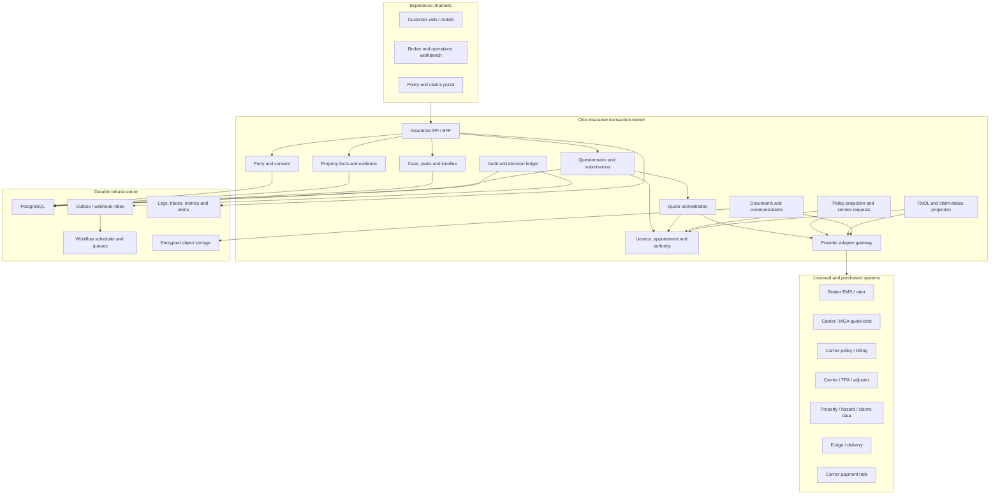

# Property Insights Insurance Platform — Independent Implementation Blueprint

_August 16, 2026 · implementation blueprint v1 · informed by the rev-3 research committee report, but independently structured for delivery_

This document translates the research under `docs/insurance/` into a build sequence. It is an engineering and product plan, not legal advice, a carrier commitment, or a representation that Property Insights is authorized to quote, bind, service, adjust, or pay insurance claims.

Primary inputs:

- [`E2E-COMMITTEE-REPORT.md`](E2E-COMMITTEE-REPORT.md)
- [`research/audit-pushbacks.md`](research/audit-pushbacks.md)
- [`research/repo-gap-and-journey.md`](research/repo-gap-and-journey.md)
- [`research/build-buy-broker-architecture.md`](research/build-buy-broker-architecture.md)
- [`research/licensing-pan-canada.md`](research/licensing-pan-canada.md)
- [`research/quote-mechanics-canada.md`](research/quote-mechanics-canada.md)
- [`research/lemonade-e2e.md`](research/lemonade-e2e.md)

---

## Implementation status — 2026-08-21

| Iteration | Repository/production state | Remaining gate |
|---|---|---|
| A0 | Deployed; production smoke and legacy affiliate/intake boundary recorded | Historical baseline only; see `A0-BASELINE.md` |
| A1 | Production migrations applied; case record and capability portal activated; idempotent canary passed | Canary KPI cleanup/exclusion, PITR console proof/restore exercise, and counsel-controlled consent/withdrawal items remain open |
| Sprint 25 closure | Closed 2026-08-21 | Production dependency audit 0; authorization negatives 8/8; Property Intelligence 143/143; journey 2,688; TypeScript/build/insurance checks pass; browser E2E 14 pass/1 intentional skip; production smoke 11/11 |
| A2 | Not started | Begins only after Sprint 25 and the P5 curated live-acceptance matrix close; simulation only |

The A1 production activation does not authorize real carrier delivery,
personalized quote, bind, policy/payment, or claims outcomes. Quote, bind, and
claim-intake runtime flags remain off. The exact operational record and open
items live in `A1-IMPLEMENTATION.md` and `OPERATIONS-MIGRATIONS.md`.

---

## 1. Delivery outcome

Build a production-shaped, provider-neutral insurance transaction platform now. It must demo the complete customer, broker, policy, and claims journey using synthetic providers, then accept real broker, carrier, MGA, BMS, property-data, document, payment, and TPA adapters without changing its domain model or customer-facing state language.

The immediate product is **not** a public unlicensed quote engine and **not** a hard-coded partner integration. It is an insurance transaction kernel plus two experience shells:

1. A customer journey that always states what is known, simulated, submitted, pending, carrier-confirmed, or unavailable.
2. A broker/operations journey that turns every exception into an owned case, task, reason, deadline, and audit event.

The implementation succeeds when a scripted synthetic lifecycle can travel through:

> discovery → property evidence → consent → versioned submission → provider acknowledgement → quote/referral/inspection/decline → bind/issue → service/renewal/cancellation → FNOL/status/complaint

while preventing every unauthorized or falsely authoritative transition.

---

## 2. Non-negotiable architecture invariants

1. **Separate authority, access, and connectivity.**
   - Distribution authority = provincial licences.
   - Market access/paper = carrier appointment or MGA/wholesale arrangement.
   - Binding/underwriting authority = written carrier delegation.
   - Connectivity = BMS, rater, portal, API, CSIO, or structured human workflow.

2. **Carrier truth wins.** Only an authenticated response from an authorized provider may create a real `QUOTED`, `BOUND`, `ISSUED`, claim-decision, or payment state.

3. **Default deny.** Missing, expired, conflicting, or stale licence, appointment, delegation, jurisdiction, product, monetary-limit, or moratorium data blocks the consequential action.

4. **State is explicit.** No generic `complete`, `success`, indefinite spinner, or inferred success from a click, payment attempt, email send, or API timeout.

5. **Facts retain provenance.** Provider evidence, user answers, user corrections, model hints, and broker attestations remain distinct records. A correction never overwrites the evidence that preceded it.

6. **Consent is an artifact, not a boolean.** Exact wording, version, language, purpose, recipients, permitted fields, grant time, withdrawal, and transaction references must be preserved.

7. **Business workflow is runtime-neutral.** State transitions and invariants live in Orio application services. Inngest, Step Functions, Temporal, queues, and cron may schedule work but must not own business meaning.

8. **Integrations are replaceable.** Provider-specific values never become the only representation of a customer, property, submission, quote, policy, claim, or document.

9. **Simulation cannot leak into production.** Simulation, vendor sandbox, and production are separate execution modes with separate data, credentials, destinations, UI labels, and allowed transitions.

10. **Claims automation is assistive initially.** Orio may collect FNOL, evidence, status, and communications. Coverage, reserves, settlement, denial, payout, subrogation, and SIU conclusions remain carrier/TPA-owned until separately delegated and licensed.

11. **The current affiliate seam keeps working.** Existing `coverage_profiles`, waitlist, partner clicks, and affiliate routing remain functional while the kernel is introduced behind new flags.

12. **No BMS is assumed.** Acturis and Applied are procurement candidates. The licensed entity or market-access agreement may dictate a different platform or no BMS initially.

---

## 3. Execution modes and public-deployment policy

Every insurance case and provider transaction carries an immutable execution mode:

| Mode | Data | External destinations | Permitted outcomes | UI requirement |
|---|---|---|---|---|
| `SIMULATION` | Synthetic only | Simulator allowlist only | Synthetic lifecycle states | Persistent demonstration banner |
| `SANDBOX` | Synthetic/test identities required by provider | Contracted provider sandbox only | Provider sandbox states, never operative coverage | Persistent sandbox banner |
| `PRODUCTION` | Consented real data | Explicitly approved production providers | Only authority-approved real states | Licensed entity, insurer and status disclosures |

Hard rules:

- Mode cannot be changed after case creation.
- Records from different modes cannot share provider credentials, queues, buckets, webhook secrets, or analytics datasets.
- Production is disabled at the authority layer by default.
- A provider adapter declares the modes it supports and fails closed in every other mode.
- Synthetic quote, policy, claim, payment, and document identifiers use visibly non-production prefixes.
- No production adapter accepts traffic from preview deployments or developer machines.

### Pre-licence public boundary

| Capability | Build now | Public before licence/partner approval |
|---|---:|---:|
| Neutral property-fact collection | Yes | Only with reviewed copy, consent, and referral structure |
| Personalized premium range | Yes in simulation | Counsel/partner gated |
| Coverage recommendation | Yes in simulation | No |
| Limit/deductible selection | Yes in simulation | Treat as licensed-flow functionality |
| Carrier-style triage/decline | Yes in simulation | No real outcome without provider authority |
| Referral submission | Yes | Only under executed referral/data-sharing agreement |
| Quote/bind/payment | Yes in simulation/sandbox | Only after licensing, market access, and delegation gates |

Question definitions must therefore include a regulatory interaction class:

- `PROPERTY_FACT` — neutral fact about the applicant/property.
- `INSURANCE_HISTORY` — insurance-specific fact; approved flow required.
- `INSURANCE_NEED` — purpose, suitability, or recommendation context; licensed-flow gate.
- `COVERAGE_CHOICE` — limit, deductible, endorsement, or product selection; licensed-flow gate.
- `BIND_ATTESTATION` — declaration/signature required by the authorized provider.

This corrects the remaining rev-3 shorthand that grouped every wizard expansion field as an “unlicensed disclosure.”

---

## 4. Logical architecture



### Repository boundaries

The current repository can remain one deployable application initially, but insurance code should be organized as bounded modules:

```text
src/lib/insurance/
  domain/              # entities, value objects, state machines, invariants
  application/         # commands, queries, transition services, authorization
  providers/           # interfaces and adapter registry
  infrastructure/      # database, outbox, webhook inbox, storage, scheduling
  simulation/          # fixtures, deterministic providers, scenario runner

src/app/api/insurance/v1/
  cases/
  submissions/
  provider-events/
  documents/
  claims/

src/app/insurance/case/[caseId]/
src/app/insurance/demo/[scenario]/
src/app/broker/insurance/
```

Existing components may call the new application layer, but domain code must not import React, Next request objects, PostHog, Resend, or provider SDKs.

---

## 5. Canonical data model

### Identity, counterparties, and authority

- `insurance_party`
- `insurance_party_identifier`
- `insurance_counterparty`
- `counterparty_role`
- `brokerage_licence`
- `staff_licence`
- `carrier_appointment`
- `delegated_authority`
- `authority_limit`
- `authority_decision`
- `moratorium`

Counterparty roles are explicit:

```text
AFFILIATE | REFERRER | BROKERAGE | AGENCY | MGA | INSURER |
RATER | BMS | TPA | ADJUSTER | DATA_PROVIDER | PAYMENT_PROVIDER
```

### Customer, property, and consent

- `canonical_address`
- `insured_property`
- `property_fact`
- `property_evidence`
- `property_attestation`
- `consent_artifact`
- `consent_recipient`
- `consent_field_scope`

### Transaction kernel

- `insurance_case`
- `case_party`
- `case_assignment`
- `case_task`
- `case_timeline_event`
- `questionnaire_definition`
- `question_definition`
- `submission`
- `submission_answer`
- `provider_submission`
- `referral`
- `inspection`

### Quote, policy, billing, and claims projections

- `quote_snapshot`
- `quote_coverage`
- `quote_condition`
- `policy_snapshot`
- `policy_transaction`
- `billing_snapshot`
- `claim_snapshot`
- `claim_event`
- `complaint`

These are synchronized projections at first live. They do not replace the carrier’s legal policy, billing, or claim record.

### Infrastructure and evidence

- `provider_connection`
- `provider_request`
- `provider_response_metadata`
- `webhook_inbox`
- `outbox_event`
- `document`
- `document_version`
- `document_access_grant`
- `communication`
- `audit_event`

### Migration rule for `coverage_profiles`

- Do not delete or repurpose the current table.
- New intake creates an `insurance_case` and submission version while retaining the existing affiliate record during the compatibility period.
- Link legacy and new records using a nullable `legacy_coverage_profile_id` on the case.
- Do not backfill historical PII until retention, consent, and purpose compatibility are reviewed.
- `vendor_id` remains affiliate-click attribution only and never becomes provider delivery evidence.

---

## 6. State machines and transition authority

### Case

```text
DRAFT → COLLECTING_FACTS → READY_FOR_SUBMISSION → SUBMISSION_IN_PROGRESS
      → ACTIVE → COMPLETED | CLOSED | WITHDRAWN
```

Case status describes orchestration. It must not substitute for quote, policy, or claim status.

### Submission and quote

```text
DRAFT
  → ENRICHING
  → NEEDS_CUSTOMER_INPUT
  → READY
  → SUBMITTING
  → AWAITING_PROVIDER
  → SUBMITTED
      → QUOTED
      → REFERRED
      → INSPECTION_REQUIRED
      → DECLINED
      → PROVIDER_ERROR

QUOTED → SELECTED → BINDING → BOUND → ISSUED
QUOTED → EXPIRED | WITHDRAWN
BINDING → BIND_FAILED
```

`QUOTED`, `BOUND`, and `ISSUED` require:

- Production or approved provider-sandbox mode.
- Authenticated provider response.
- Provider quote/policy identifier.
- Carrier/product/rules version where available.
- Authority decision reference.
- Effective and expiry timestamps.
- Immutable normalized snapshot plus raw-response reference.

### Policy

```text
PENDING_EFFECTIVE → ACTIVE
ACTIVE → ENDORSEMENT_REQUESTED → ENDORSED | REQUEST_REJECTED
ACTIVE → RENEWAL_PENDING → RENEWED | NON_RENEWED | EXPIRED
ACTIVE → CANCELLATION_REQUESTED → CANCELLED | REQUEST_REJECTED
ACTIVE → LAPSE_PENDING → LAPSED | REINSTATED
```

### Claim

```text
DRAFT → SUBMITTING → CARRIER_CONFIRMATION_PENDING → RECEIVED
RECEIVED → NEEDS_INFORMATION | ASSIGNED | UNDER_REVIEW
UNDER_REVIEW → APPROVED | PARTIALLY_APPROVED | DENIED
APPROVED | PARTIALLY_APPROVED → PAYMENT_PENDING → PAID → CLOSED
CLOSED → REOPENED
```

At first live, Orio may originate `DRAFT`, `SUBMITTING`, and `CARRIER_CONFIRMATION_PENDING`. Later claim states come from the carrier/TPA.

### Authority result

Every consequential command returns one of:

```text
ALLOW
DENY
REQUIRE_LICENSED_REVIEW
REQUIRE_CARRIER_REVIEW
REQUIRE_SECOND_APPROVAL
```

An authority result contains the evaluated facts, configuration version, reason codes, timestamp, and expiry. It is recalculated at execution time; an old successful result cannot authorize a later bind, cancellation, settlement, or payment.

---

## 7. Provider contract

Core provider interfaces:

- `AddressProvider`
- `PropertyEvidenceProvider`
- `ReplacementCostProvider`
- `HazardProvider`
- `ClaimsHistoryProvider`
- `IdentityProvider`
- `SubmissionProvider`
- `QuoteProvider`
- `BmsProvider`
- `PolicyProvider`
- `ClaimProvider`
- `DocumentProvider`
- `SignatureProvider`
- `PaymentProvider`
- `CommunicationProvider`

Every request and result uses a common envelope:

```text
request_id
idempotency_key
correlation_id
causation_id
execution_mode
case_id
aggregate_id
schema_version
consent_artifact_ids
authority_decision_id
provider_connection_id
requested_at
responded_at
provider_external_id
provider_status
normalized_reason_codes
raw_payload_reference
retryable
```

### Adapter conformance requirements

Every real and synthetic adapter must pass the same contract tests:

- Authentication and secret isolation
- Idempotent submit/bind/FNOL commands
- Duplicate webhook handling
- Out-of-order webhook handling
- Timeout and retry classification
- Signed webhook verification
- Reconciliation read
- Rate-limit behavior
- Raw-response preservation and redaction
- Enum/version compatibility
- Provider withdrawal/disabled mode
- Export of all Orio-owned data

---

## 8. Iterative delivery sequence

Each iteration is a shippable vertical slice with its own tests and a visible demo outcome. Iteration completion is based on acceptance criteria, not elapsed time.

### Phase A — pre-authority transaction platform

#### Iteration A0 — truth, safety, and compatibility baseline

**Goal:** make the current affiliate experience an explicit, tested legacy seam before adding the kernel.

Deliverables:

- Reconfirm production insurance stage and run production smoke tests.
- Truth-sweep user-facing Square One/APOLLO role, geography, line, compensation, and “no phone call” copy.
- Distinguish `AFFILIATE`, `AGENCY`, `BROKERAGE`, `MGA`, and `INSURER` in configuration.
- Add execution-mode and kernel feature flags with production default-deny.
- Record the existing funnel baseline and current journey-matrix snapshot.
- Define sequential database migration and rollback conventions for the insurance domain.

Acceptance:

- Current landing/intake E2E tests still pass.
- No provider is called a broker unless its configured role is `BROKERAGE`.
- Production cannot enable simulator quote/bind/claims results.
- Flag/config failure narrows functionality instead of widening it.

#### Iteration A1 — case, consent, and versioned submission

**Goal:** turn one coverage-profile completion into a durable case with an immutable submission version.

Deliverables:

- `insurance_case`, parties, case timeline, consent artifact, submission, answers, and audit events.
- Field-level origin: `USER`, `LISTING`, `ASSESSMENT`, `PROVIDER`, `MODEL_HINT`, `BROKER`.
- User-attested corrections stored separately from source evidence.
- Idempotent create/update/finalize commands.
- Compatibility link to the current `coverage_profiles` row.
- Customer case-status page showing only fact-collection states.

Acceptance:

- Retrying finalize cannot create duplicate submissions or cases.
- Editing after finalization creates a new submission version.
- Exact consent text and intended recipients are reconstructable.
- `vendor_id` remains unrelated to delivery acknowledgement.
- Existing affiliate handoff continues unchanged behind its current flag.

#### Iteration A2 — durable delivery spine and simulator adapter

**Goal:** submit the versioned payload through a provider-neutral interface and prove delivery semantics.

**Start gate:** Sprint 25 dependency/auth closure and the P5 curated live
acceptance matrix are both recorded as passed. A2 is not an alternative way to
bypass either gate and does not add a new public product-stage switch.

Deliverables:

- Transactional outbox.
- Signed/deduplicated webhook inbox.
- `SubmissionProvider` interface and deterministic simulator.
- Provider request/response metadata.
- Acknowledgement, timeout, retry, dead-letter, replay, and reconciliation workflows.
- Operator exception queue for failed or conflicting events.

Acceptance:

- Database commit and event creation are atomic.
- Duplicate submit returns the original provider transaction.
- Duplicate/out-of-order webhooks produce one valid transition.
- Timeout produces `AWAITING_PROVIDER`/task state, never success or decline.
- Replaying the inbox reconstructs the same projection.

#### Iteration A3 — broker operations workbench

**Goal:** replace email as the operational source of truth.

Deliverables:

- New, incomplete, failed-delivery, referred, inspection, and stale-case queues.
- Case 360: parties, property facts/evidence, consent, submission versions, timeline, documents, communications.
- Assignment, ownership, notes, tasks, due dates, escalation, and reason codes.
- Role-based UI with read/write separation.
- Customer-visible next step, owner, and expected-update field.
- Email remains notification only and deep-links to the case.

Acceptance:

- Every nonterminal submission has a system or human owner.
- Every manual-review state has a reason and next action.
- A broker cannot alter original customer/provider evidence.
- Access and mutations produce audit events.
- Email failure cannot lose or close a case.

#### Iteration A4 — synthetic quote and authority vertical slice

**Goal:** demo straight-through and exception journeys using production state semantics.

Deliverables:

- Versioned questionnaire and question interaction classes.
- Versioned rules configuration by jurisdiction, product, provider, effective date, and mode.
- Authority evaluator with default-deny production configuration.
- Quote snapshots, coverages, conditions, expiry, selection, bind and issue simulation.
- Explicit customer states and broker reason codes.
- Synthetic premium/wording clearly marked and isolated.

Acceptance:

- Only simulator-signed events can create synthetic quote/bind/issue states.
- No simulation state or document can appear outside simulation tenancy.
- Threshold change creates a new configuration version and does not rewrite historical decisions.
- Missing authority blocks bind and creates an actionable case.
- Quote expiry and fact change require re-rate.

#### Iteration A5 — synthetic policy-service shell

**Goal:** prove the post-bind customer and broker journey without pretending Orio is the policy system of record.

Deliverables:

- Policy snapshots and transaction requests.
- Document vault UI using synthetic declarations/wording.
- Endorsement, payment-method, mortgagee, cancellation, renewal, non-renewal, lapse, and reinstatement request states.
- “Requested / under review / carrier confirmed / effective” language.
- Provider reconciliation and mismatch queue.

Acceptance:

- Customer request never directly mutates the carrier-confirmed policy projection.
- Policy documents show source, version, delivery time, and simulation status.
- Payment attempt cannot create bound/active status.
- Conflicting policy events freeze automation and open an exception task.

#### Iteration A6 — synthetic FNOL and claim-status shell

**Goal:** prove the claims experience while maintaining the adjuster/settlement boundary.

Deliverables:

- Guided FNOL, emergency guidance, consent, evidence-upload metadata, carrier-confirmation pending state.
- Claim snapshot/timeline and normalized carrier statuses.
- Assigned handler and communication view.
- Complaint classification and escalation.
- Explicit absence of reserve, decision, payout, SIU conclusion, or settlement controls for Orio roles.

Acceptance:

- Claim number is not shown until the simulator/TPA acknowledges it.
- Evidence receipt is distinct from carrier receipt.
- Claims support roles cannot create decisions or payments.
- Status conflict creates a neutral customer state and broker task.
- All claim media are synthetic in simulation mode.

#### Iteration A7 — security, privacy, resilience, and demonstration release

**Goal:** make the complete synthetic platform safe to demonstrate and structurally ready for vendor sandboxes.

Deliverables:

- Staff MFA/SSO enforcement plan and fine-grained RBAC/ABAC.
- Data classification and telemetry allowlist; restricted payloads excluded from PostHog.
- Document storage adapter with encryption, short-lived access, hash, scan, quarantine, retention, and legal-hold states.
- Secrets isolation and rotation interface.
- OpenTelemetry traces and business-SLA metrics.
- Backup/restore, provider outage, key loss, and degraded-mode runbooks.
- Demo scenario launcher and evidence report.

Acceptance:

- All 23 scenarios below pass from UI through audit ledger.
- Restore test reconstructs case, submission, quote/policy/claim projections, and document metadata.
- Provider outage leaves intake durable and exposes an honest pending state.
- Demo destinations are allowlisted; production credentials are inaccessible.
- Security/privacy review finds no restricted fields in product analytics.

### Phase B — agreement-bound market activation

Phase B begins only for a named licensed entity, insurer/MGA market, product, jurisdiction, and integration path. Its iterations are repeated per market rather than generalized prematurely.

#### Iteration B1 — contracted schema and common-facts questionnaire

- Import the carrier/MGA submission dictionary and product version.
- Map canonical facts to provider fields.
- Add only questions required by the contracted market.
- Obtain approval for question wording, consent, disclosures, triage language, and unlicensed/licensed staff boundaries.
- Add property/rebuild/hazard/claims-history providers only as approved.

**Exit:** a complete synthetic case validates against the real provider schema with no unmapped required field.

#### Iteration B2 — sandbox quote and referral

- Implement the real submission/quote adapter.
- Verify authentication, idempotency, reasons, referral documents, quote versions, expiry, replay, and reconciliation.
- Route manual referrals to authorized staff.

**Exit:** provider sandbox returns quote/referral/decline/inspection states and passes the adapter conformance suite.

#### Iteration B3 — production quote activation

- Load licences, appointments, delegation, product and moratorium controls.
- Complete privacy/security/vendor diligence and penetration testing.
- Run controlled production shadow submissions before customer-visible activation.
- Enable real quote presentation only after carrier/broker sign-off.

**Exit:** production quote snapshots reconcile to the carrier/BMS and every display state is approved.

#### Iteration B4 — bind, payment, issue, and documents

- Use carrier-hosted payment/direct bill first.
- Implement bind attestations, effective-time semantics, mortgagee/loss-payee, issue acknowledgement, e-delivery and correction workflows.
- Keep payment and carrier bind confirmations separate.

**Exit:** controlled quote → bind → issue → document delivery reconciles end to end with no inferred state.

### Phase C — live lifecycle service

#### Iteration C1 — policy self-service

- Carrier-confirmed documents and policy view.
- Endorsement, mortgagee, cancellation, billing and payment-method request workflows.
- Only explicitly delegated low-risk changes may become straight-through.

#### Iteration C2 — renewals and retention

- Renewal/non-renewal ingestion, updated evidence, notices, remarketing tasks, lapse/reinstatement and complaint handling.
- Automation remains carrier- and authority-configured.

#### Iteration C3 — live FNOL and claim status

- Carrier/TPA-approved intake, evidence transfer, acknowledgement, handler and status feed.
- Carrier/TPA remains claim system of record and payment owner.

### Phase D — repeatable expansion and delegated authority

#### Iteration D1 — second carrier or MGA

- Prove that a second adapter reuses the canonical model and conformance suite.
- Add comparison only where the licensed operating model and market-conduct rules permit it.

#### Iteration D2 — second province

- Add jurisdiction-specific licence/entity/appointment/disclosure/complaint configuration.
- Demonstrate that BC assumptions do not leak into the new province.

#### Iteration D3 — MGA/delegated programme

- Consider a PAS only when Orio controls product/rules/billing/bordereaux under written authority.
- Add delegated underwriting or claims controls only within explicit authority and audit obligations.

---

## 9. Synthetic scenario acceptance suite

The demonstration and adapter suite covers these 23 scenarios:

1. Clean straight-through quote
2. Missing required facts
3. Contradictory property evidence
4. Multiple-claims referral
5. Old/unknown-roof inspection
6. Oil-tank referral
7. Wood-stove/WETT evidence request
8. High-value/custom-glass review
9. Unsupported occupancy or product
10. Carrier decline
11. Catastrophe moratorium
12. Provider timeout
13. Provider rate limit
14. Duplicate submission
15. Duplicate webhook
16. Out-of-order webhook
17. Quote expiry and re-rate
18. Bind payment failure
19. Successful bind and issue
20. Endorsement request and carrier rejection
21. Renewal/non-renewal
22. FNOL acknowledgement and needs-information path
23. Claim-status conflict or TPA outage

Every scenario asserts:

- Customer-visible state and wording
- Broker queue/task ownership
- Allowed and denied actions
- Authority decision
- Audit events
- Provider request count and idempotency
- Recovery/replay outcome
- No restricted data leakage to analytics

---

## 10. Parallel procurement and counsel track

These activities run alongside Phase A without coupling the kernel to an answer:

| Workstream | Required output | Architecture impact |
|---|---|---|
| Operating entity | Sub-broker, new brokerage, acquired brokerage, MGA white-label, or carrier-embedded decision | Determines BMS ownership and supervisory model |
| BC self-serve supervision | Written counsel/regulator interpretation | Determines licensed-human gates and staff roles |
| Pre-licence public boundary | Approval for facts intake, personalized ranges, triage language and coverage questions | Determines which demo surfaces may become public |
| Market access | Named insurer appointment or MGA/wholesale arrangement | Provides paper and product authority |
| Binding authority | Written authority matrix and limits | Populates runtime authority configuration |
| BMS/rater | Scripted Acturis/Applied/host-platform evaluation | Selects `BmsProvider` adapter only |
| Property data | Verisk/Opta API, terms, sandbox, approved uses | Selects evidence/replacement-cost adapters |
| Claims | Carrier/TPA system owner, FNOL/status contract and escalation | Selects claim adapter and live boundary |
| Payments | Direct-bill, merchant, trust, refunds and reconciliation responsibility | Determines whether embedded payment is in scope |
| Security/privacy | DPA, residency, subprocessors, breach SLA, export/deletion | Determines approved production infrastructure/providers |

No private vendor capability, price, sandbox, timeline, or Canadian residency claim is treated as resolved until evidenced in a scripted demonstration and contract.

---

## 11. Definition of done for every iteration

An iteration is complete only when:

- The customer and broker journeys both work for the slice.
- State transitions are explicit and covered by unit tests.
- Forbidden transitions have negative tests.
- The operation is idempotent where retry is possible.
- Audit events reconstruct who/what/when/why.
- Accessibility and mobile behavior are verified for new customer UI.
- Restricted data is absent from analytics and logs.
- Failure states are visible and actionable.
- Feature flags fail closed.
- Existing affiliate journey tests remain green.
- Documentation identifies whether the capability is simulation-only, sandbox-approved, or production-authorized.

---

## 12. Decisions deliberately not made in this blueprint

- Acturis versus Applied Epic/Rating Services
- Host brokerage versus new/acquired brokerage
- Carrier appointment versus MGA/wholesale route
- Inngest versus Step Functions versus Temporal as the live scheduler
- Neon versus Canadian-region PostgreSQL for production restricted data
- Exact property, hazard, identity, e-sign, communication, observability, or payment vendor
- Personalized indicative premium methodology
- Carrier-specific thresholds or question counts
- Automated claims decisions or payouts
- A carrier/MGA PAS

These decisions do not block Phase A because each sits behind an owned interface or authority/configuration boundary.

---

## 13. Recommended starting point

Start with **Iteration A0**, then **A1**. They resolve current product truth, establish the compatibility boundary, and create the first durable vertical slice without pretending a partner API exists.

The first milestone demonstration should be:

> A user completes the existing coverage profile → an immutable case and submission version are created with evidence and consent → the customer sees an honest status timeline → the current affiliate handoff still works → an operator can inspect the case without relying on email.

Do not start by expanding underwriting questions, building personalized premium ranges, selecting a BMS, or implementing carrier-shaped DTOs. Those become configuration and adapters after the transaction kernel can preserve version, provenance, consent, delivery, authority, and failure state correctly.
